# Diagramas de Arquitetura — Plataforma de Eventos e Ingressos

Este documento reúne os principais diagramas arquiteturais da plataforma e destaca as decisões técnicas que justificam a estrutura escolhida.

---

## 1. Visão geral da arquitetura

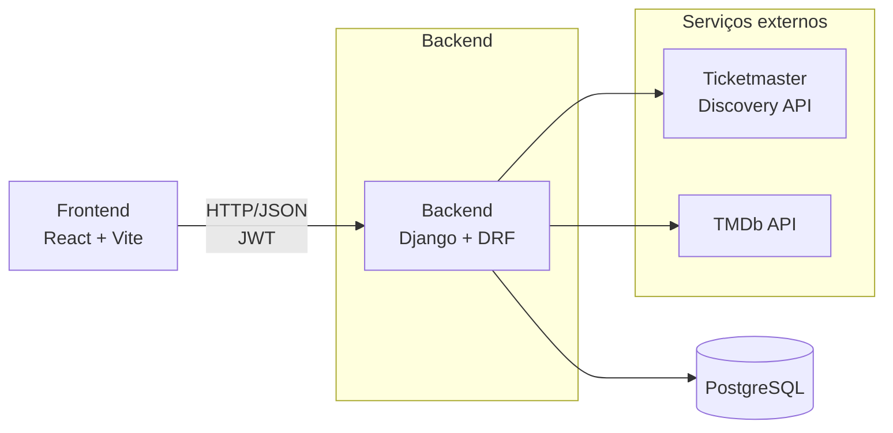

### Decisão técnica

O frontend se comunica somente com o backend. As integrações com Ticketmaster e TMDb ficam centralizadas no Django.

Isso protege as chaves das APIs externas, reduz o acoplamento do frontend aos fornecedores e permite que o backend normalize as respostas externas.

---

## 2. Arquitetura interna do Django

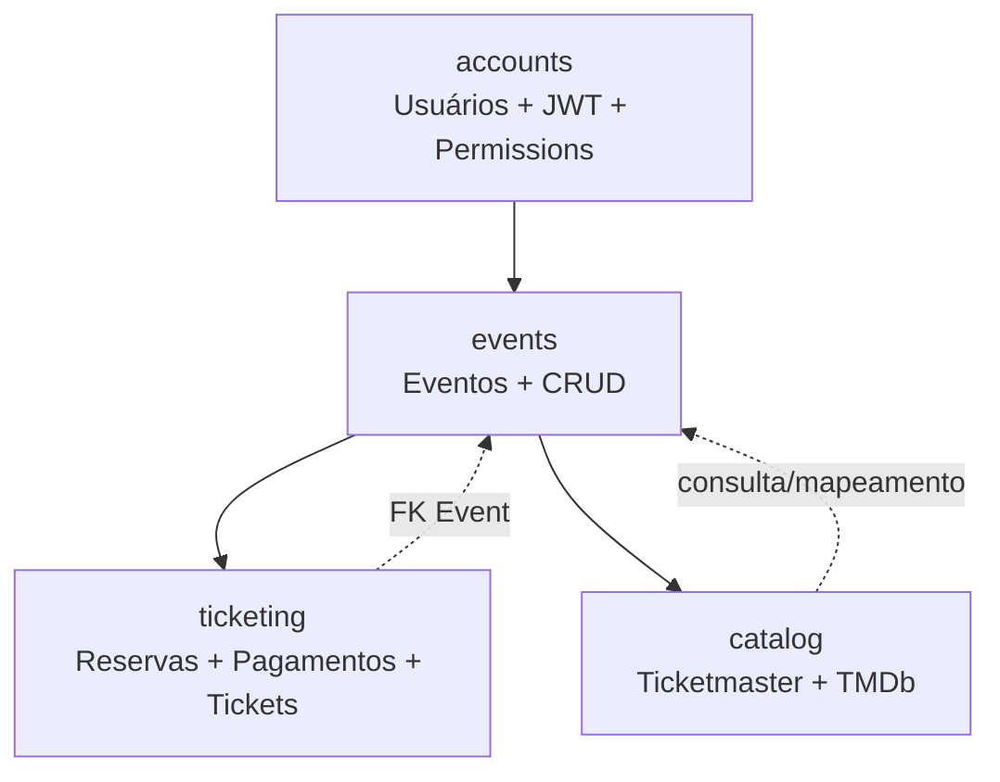

### Responsabilidades

| App | Responsabilidade |
|---|---|
| `accounts` | Usuários, papéis, JWT e permissions |
| `catalog` | Integração com Ticketmaster/TMDb |
| `events` | CRUD e consulta de eventos |
| `ticketing` | Reservas, pagamentos, ingressos e validação |

### Decisão técnica

Os apps são separados por domínio de negócio. Isso reduz o acoplamento e mantém cada módulo responsável por uma parte específica do sistema.

A direção principal das dependências é:

```text
accounts
   │
   ▼
events
   │
   ├──────────────► catalog
   │
   ▼
ticketing
```

`events` não importa `ticketing` diretamente no nível de módulo. A propriedade `Event.tickets_sold` utiliza import local para evitar uma dependência circular, já que `Reservation` referencia `Event`.

---

## 3. Integração com catálogo externo e snapshot

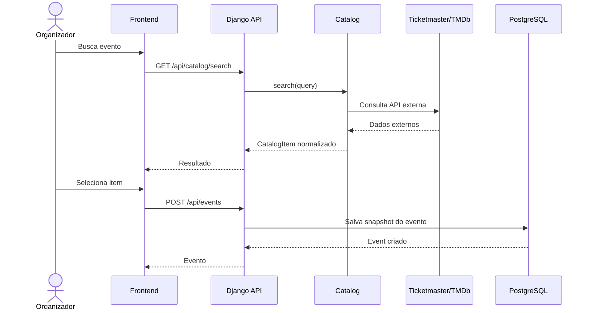

### Snapshot do catálogo

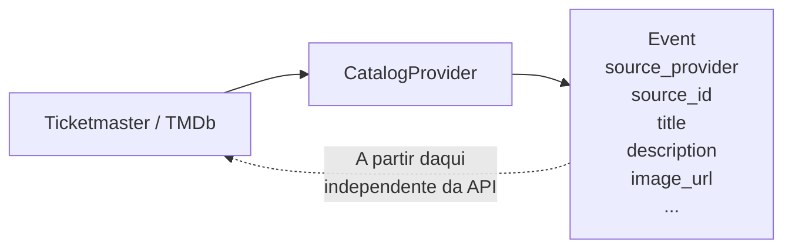

### Decisão técnica

O catálogo externo é utilizado como fonte de descoberta, não como uma referência viva do evento.

Depois que o organizador escolhe um item, os dados são copiados para `Event`. O organizador pode editar esses dados posteriormente sem depender da disponibilidade ou do estado atual da API externa.

---

## 4. Fluxo de reserva e pagamento

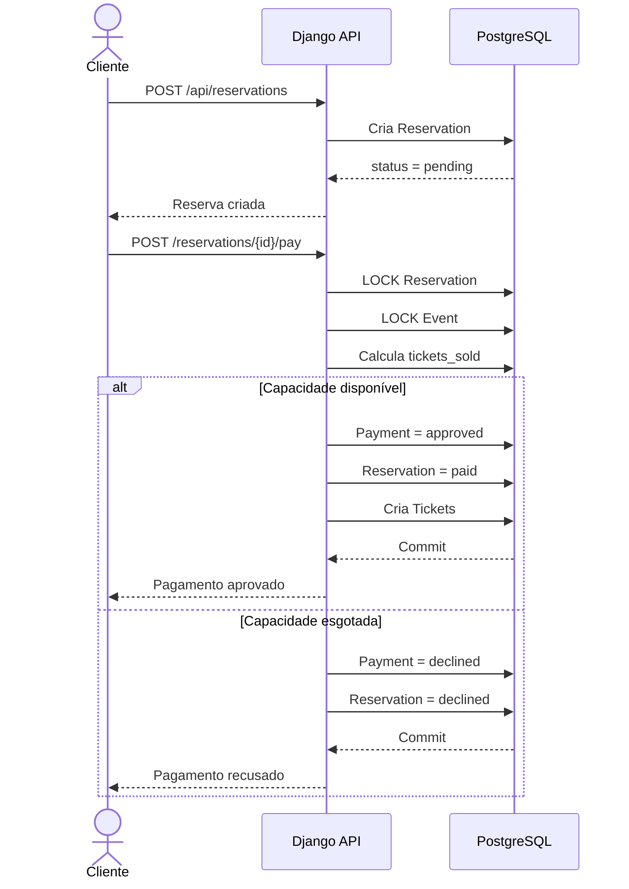

### Estados da reserva

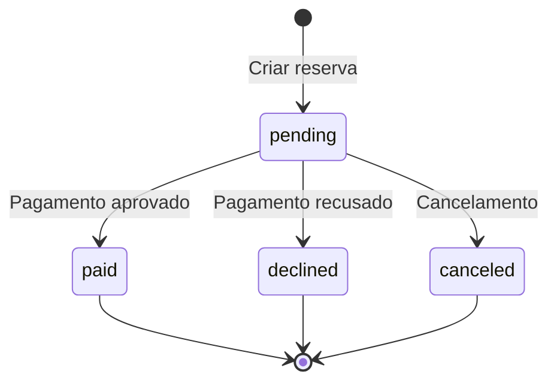

### Decisão técnica

Criar uma reserva não significa consumir o estoque.

Somente reservas com:

```text
Reservation.status == "paid"
```

são consideradas no cálculo de ingressos vendidos.

Isso separa claramente:

- intenção de compra;
- processamento do pagamento;
- consumo efetivo da capacidade.

---

## 5. Concorrência e controle de capacidade

Essa é uma das principais decisões técnicas da aplicação.

### Problema

Imagine um evento com capacidade para 100 pessoas e apenas 2 vagas restantes.

Dois clientes podem tentar comprar 2 ingressos simultaneamente.

Sem controle de concorrência:

```text
Cliente A                    Cliente B
    │                            │
    │ tickets_sold = 98         │
    │                            │
    │                            │ tickets_sold = 98
    │                            │
    │ compra 2                   │ compra 2
    │                            │
    └────────────┬───────────────┘
                 ▼
          102 ingressos
          CAPACIDADE = 100
                 ❌
```

### Solução com row locking

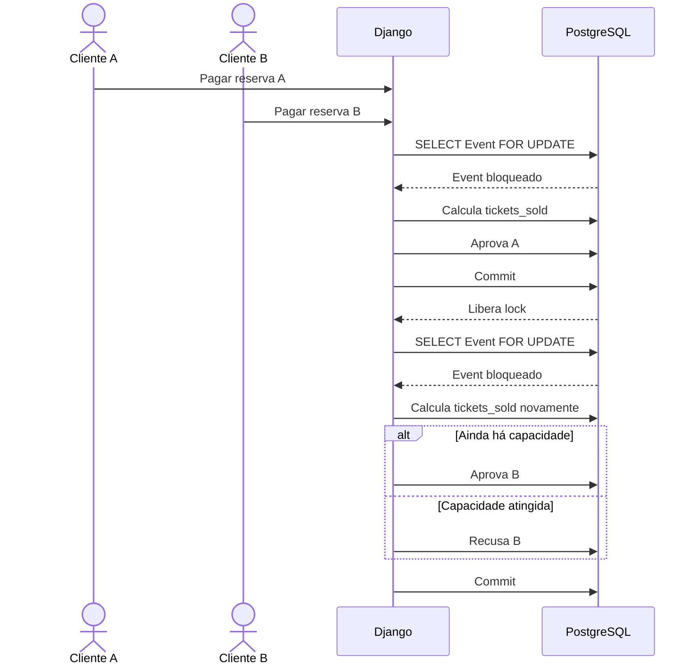

### Garantia

O pagamento utiliza:

```text
transaction.atomic()
        +
select_for_update()
```

A reserva é bloqueada e o evento também é bloqueado antes da decisão final de pagamento.

A capacidade é recalculada dentro da transação e dentro do lock.

### Por que essa abordagem?

O objetivo é impedir que duas transações concorrentes enxerguem simultaneamente o mesmo estoque disponível e ultrapassem a capacidade do evento.

---

## 6. Proteção contra pagamento duplicado

O lock também protege contra situações como:

- duplo clique;
- retry de rede;
- duas requisições simultâneas;
- tentativa de pagar novamente a mesma reserva.

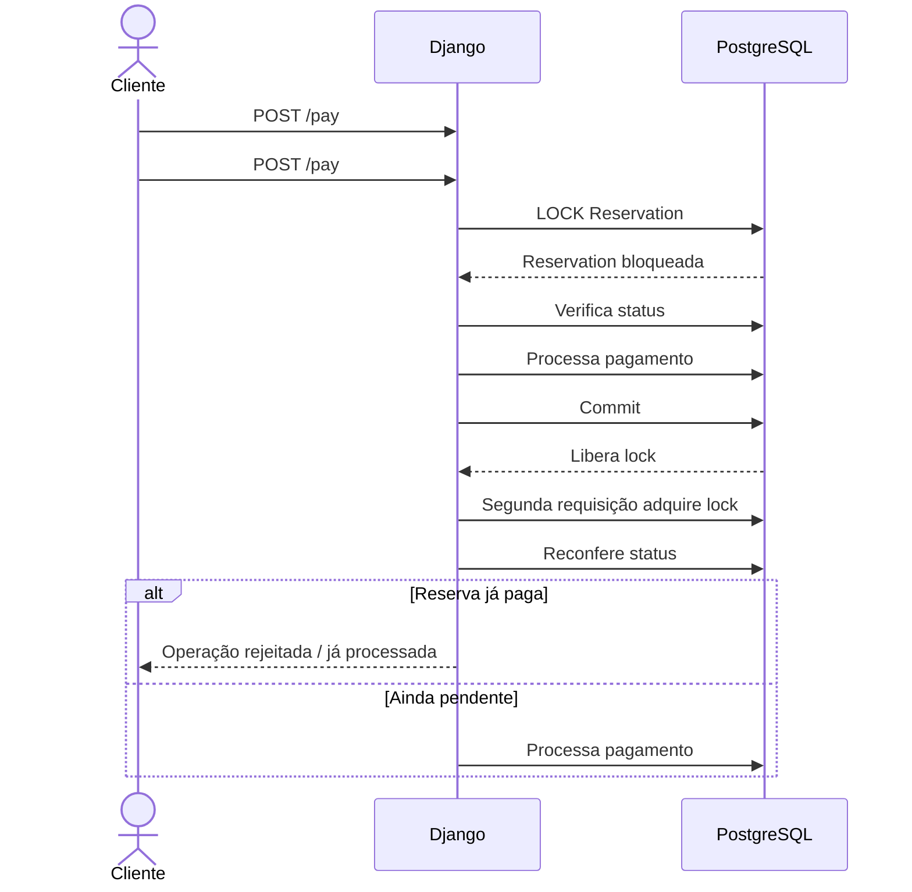

### Decisão técnica

O status da reserva é reconferido **dentro da transação**, e não apenas antes dela.

Isso evita que duas requisições criem dois pagamentos para a mesma reserva.

---

## 7. Segurança do QR Code

O QR Code não contém simplesmente o `public_code`.

O código é assinado pelo backend utilizando o mecanismo de signing do Django.

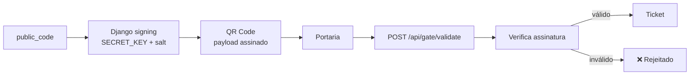

### Por que assinar o QR?

O backend possui o `SECRET_KEY`, portanto um usuário externo não consegue simplesmente criar um payload válido para um ingresso inexistente.

A assinatura garante a autenticidade do payload.

---

## 8. Validação do ingresso na portaria

A API aceita duas formas de identificação:

1. payload assinado vindo do QR Code;
2. `public_code` digitado manualmente pela portaria.

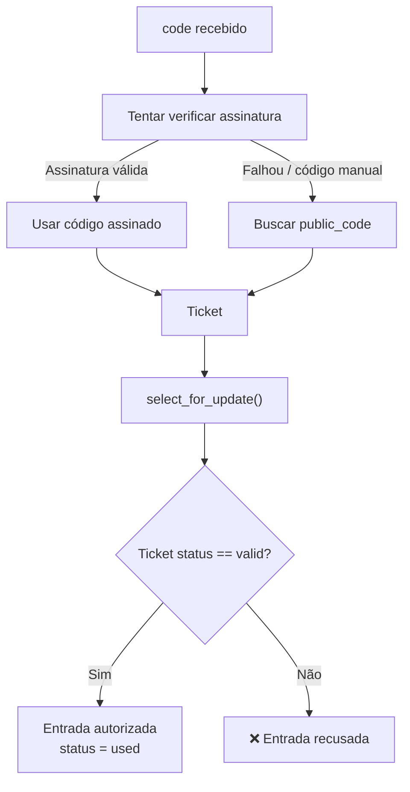

### Controle contra dupla validação

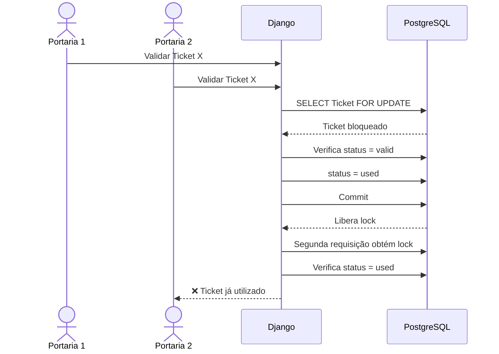

### Decisão técnica

O ticket é bloqueado durante a validação.

Assim, duas portarias não conseguem validar o mesmo ingresso simultaneamente.

---

## 9. Modelo de dados

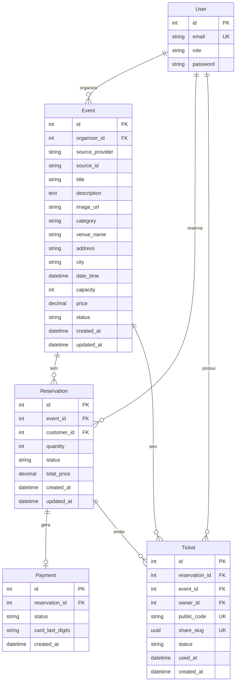

---

## 10. Por que `Ticket.event` é denormalizado?

O relacionamento principal já existe:

```text
Ticket → Reservation → Event
```

Mesmo assim, `Ticket` mantém:

```text
event_id
```

diretamente.

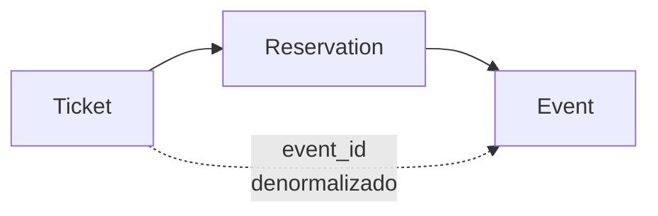

### Decisão técnica

Essa denormalização é intencional.

Na portaria, é útil consultar diretamente o ticket e seu evento para verificar se o ingresso pertence ao evento esperado, evitando um join adicional nessa operação.

---

## 11. Arquitetura de autenticação e autorização

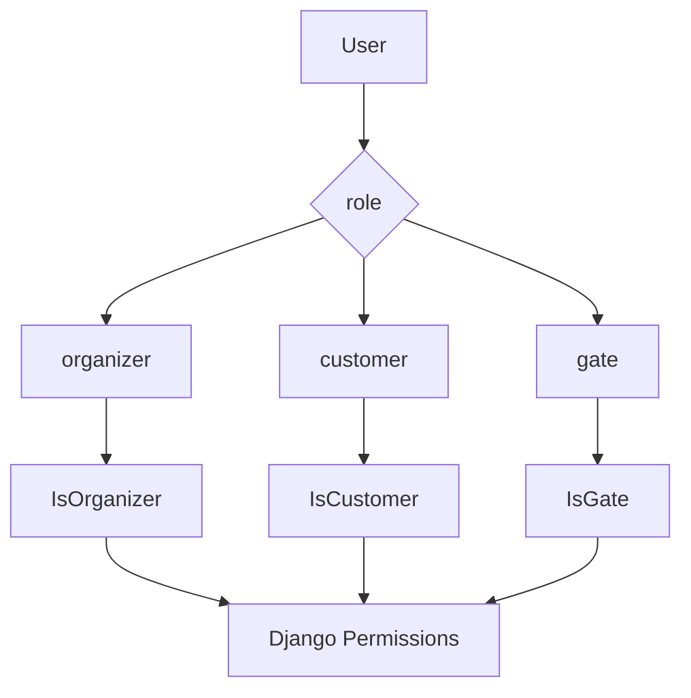

### Fluxo JWT

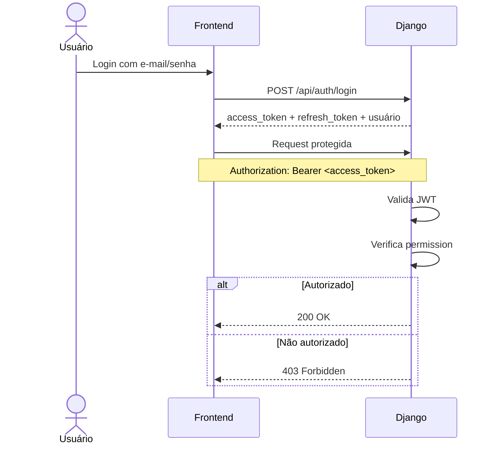

---

# 12. Resumo das principais decisões

| Problema | Decisão | Benefício |
|---|---|---|
| Organização do backend | Apps separados por domínio | Menor acoplamento |
| APIs externas | Backend como intermediário | Segurança e abstração |
| Dados externos | Snapshot em `Event` | Independência das APIs |
| Autenticação | JWT | API stateless |
| Autorização | Roles + permissions | Controle por responsabilidade |
| Estoque | Contabilizar apenas `paid` | Regra de negócio clara |
| Concorrência | `select_for_update()` | Evita overselling |
| Pagamento duplicado | Lock da `Reservation` | Idempotência operacional |
| QR Code | Payload assinado | Evita falsificação |
| Validação do ticket | Lock do `Ticket` | Evita dupla entrada |
| Ticket → Event | Denormalização | Consulta eficiente na portaria |
| Dependência circular | Import local em `tickets_sold` | Mantém separação dos apps |

---

A API completa está documentada via Swagger em `/api/docs`, conforme a arquitetura definida no projeto.
